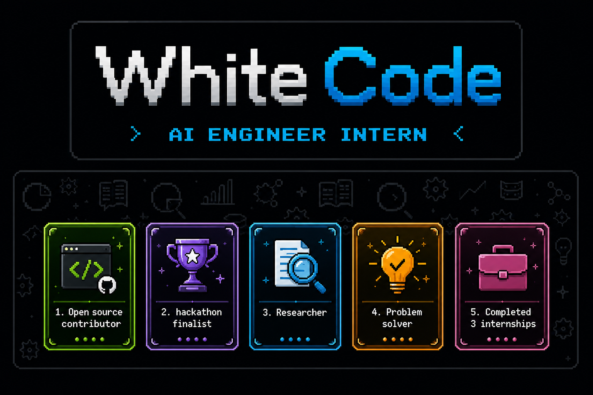
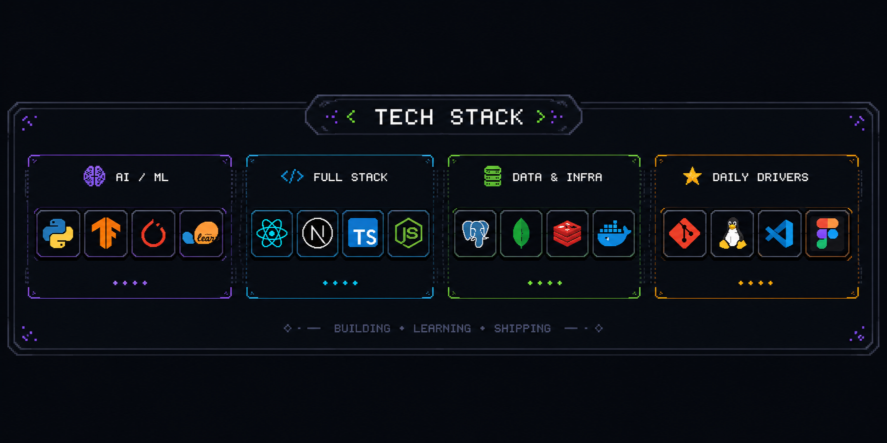

[Portfolio](https://live-portfolio-1.onrender.com/) &nbsp;·&nbsp;
[instagram](https://www.instagram.com/hetavi2905/) &nbsp;·&nbsp;
[linkedin](https://www.linkedin.com/in/hetavi-modi-68a9ab290/) &nbsp;·&nbsp;
[email](mailto:hetavimodi29@gmail.com)

> Final Year CS student at Sinhgad Academy of Engg, Pune 
> Ex AI Engineer at WhiteCode.
> Small, sharp tools over big vague ideas.

I build fast, test on real users, and kill what doesn't work. Right now that's 
[neural-lam](https://github.com/HetaviM29/neural-lam) — an open source project where I am an active contributor working on 
functionalities, documentation, and automation.

**[ehr-system](https://github.com/HetaviM29/EHR-System)** &nbsp;·&nbsp; <samp>healthcare, full stack</samp> 
Electronic Health Record system for securely managing patient medical data, 
clinical records, appointments, and healthcare information.

**[trend-analyzer](https://github.com/HetaviM29/ent-trend-analyzer)** &nbsp;·&nbsp; <samp>data analytics, trends</samp> 
Trend analysis platform for identifying patterns, tracking emerging trends, 
and extracting actionable insights from entertainment data.

**[ai-resistant-phishing-detector](https://github.com/HetaviM29/AI-resistent-Phishing-and-deception-framework)** &nbsp;·&nbsp; <samp>cybersecurity, ai</samp> 
AI-resistant phishing and deception detection framework designed to identify 
sophisticated phishing attacks and AI-generated social engineering threats.

**[student-management-system](https://github.com/HetaviM29/User-Management-System-NDA)** &nbsp;·&nbsp; <samp>full stack</samp> 
Interactive dashboard built to improve efficiency, manage students, pay course fees and download 
syllabus.

